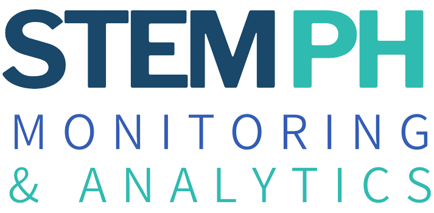

<div id="top"></div>

<!-- PROJECT SHIELDS -->
<!--
*** I'm using markdown "reference style" links for readability.
*** Reference links are enclosed in brackets [ ] instead of parentheses ( ).
*** See the bottom of this document for the declaration of the reference variables
*** for contributors-url, forks-url, etc. This is an optional, concise syntax you may use.
*** https://www.markdownguide.org/basic-syntax/#reference-style-links
[![Contributors][contributors-shield]][contributors-url]
[![Forks][forks-shield]][forks-url]
[![Stargazers][stars-shield]][stars-url]
[![Issues][issues-shield]][issues-url]
[![MIT License][license-shield]][license-url]
[![LinkedIn][linkedin-shield]][linkedin-url]
-->


<!-- PROJECT LOGO -->
<br />
<div align="center">
  <a href="https://github.com/othneildrew/Best-README-Template">
    
  </a>

  <h3 align="center">STEM Monitoring and Analytics</h3>

  <p align="center">
    A joint project by the Asian Institute of Management Masters in Data Science Program (AIM MSDS) and the Unilab Foundation!
    <br />
    <a href="https://drive.google.com/file/d/1Q13vDqy4wxeH4Xw2IizTREKlhdH2raW3/view?usp=sharing"><strong>Explore the Report»</strong></a>
    <br />
    <br />
    <a href="https://docs.streamlit.io/">Check Streamlit</a>
    ·
    <a href="https://github.com/AstroMC98/STEM-Monitoring-and-Analytics/issues">Report Bug</a>
    ·
    <a href="https://github.com/AstroMC98/STEM-Monitoring-and-Analytics/issues">Request Feature</a>
  </p>
</div>


<!-- TABLE OF CONTENTS -->
<details>
  <summary>Table of Contents</summary>
  <ol>
    <li>
      <a href="#about-the-project">About The Project</a>
      <ul>
        <li><a href="#built-with">Built With</a></li>
      </ul>
    </li>
    <li>
      <a href="#getting-started">Getting Started</a>
      <ul>
        <li><a href="#prerequisites">Prerequisites</a></li>
        <li><a href="#installation">Installation</a></li>
      </ul>
    </li>
    <li><a href="#usage">Usage</a></li>
    <li><a href="#contributing">Contributing</a></li>
    <li><a href="#license">License</a></li>
    <li><a href="#contact">Contact</a></li>
    <li><a href="#acknowledgments">Acknowledgments</a></li>
  </ol>
</details>


<!-- ABOUT THE PROJECT -->
## About The Project

STEM PH Monitoring and Analytics (STEMma) is a joint project by the Asian Institute of Management Masters in Data Science Program (AIM MSDS) and the Unilab Foundation, which seeks to develop a deeper understanding of the emerging skill gaps in the ever-changing labor market. As a valued addition to the valiant efforts of the STEM Leadership Alliance PH, STEMma aims to help policymakers, educators, students, and job seekers understand the dynamics and current demands of the Philippine Labor Market.

STEMma presents a simple framework that leverages Data Science concepts such as statistical analytical tools, network science, and natural language processing (NLP) techniques. Our "bottom-up" methodology examines the dynamics of the labor market through open job vacancies (OJVs) to better understand the larger, more general forces that influence market readiness and adaptiveness of our STEM graduates. In its current iteration, STEMma presents a five-step framework that includes:
* Skill identification from both OJVs and tertiary-level curriculums
* Development of a skill taxonomy
* Identification of emerging jobs
* The contrast of labor market skill demands and skill outputs,
* and Policy development guide through the employment of the insights from STEMma with the interpretation of subject matter experts (SMEs). 

<p align="right">(<a href="#top">back to top</a>)</p>


### Built With

* Streamlit
* Gensim
* Pandas
* Numpy
* spaCy
* Lightcast / EMSI Burning Glass Skill Taxonomy
* O*NET Skills Database

<p align="right">(<a href="#top">back to top</a>)</p>


<!-- GETTING STARTED -->
## Getting Started

This project requires a Python Environment to launch and host the dashboard. 

### Prerequisites

* Download Anaconda Environment from [https://www.anaconda.com/](https://www.anaconda.com/)
* Download or Clone this Repository to an Empty Folder.

### Installation

_Below is the step-by-step instructions to launch the STEMma Dashboard._

1. Open Anaconda Prompt from Start Menu.
2. Navigate to Disk or Location of Repository
3. Create a Python Environment
   ```sh
   conda create -n stemma python=3.6.15
   ```
4. Activate Python Environment
   ```sh
   conda activate stemma
   ```
5. Install Python packages and dependencies.
   ```sh
   pip install -r requirements.txt
   ```

<p align="right">(<a href="#top">back to top</a>)</p>


<!-- USAGE EXAMPLES -->
## Usage

The dashboard can be launched through the anaconda prompt by typing the following while in the project folder
   ```sh
   streamlit run main.py
   ```

_For more detailed examples of how to launch Streamlit Apps, please refer to the [Documentation](https://docs.streamlit.io/library/get-started)_

<p align="right">(<a href="#top">back to top</a>)</p>

<!-- CONTRIBUTING -->
## Contributing

If you have a suggestion that would make this better, please fork the repo and create a pull request. You can also simply open an issue with the tag "enhancement".
Don't forget to give the project a star! Thanks again!

1. Fork the Project
2. Create your Feature Branch (`git checkout -b feature/AmazingFeature`)
3. Commit your Changes (`git commit -m 'Add some AmazingFeature'`)
4. Push to the Branch (`git push origin feature/AmazingFeature`)
5. Open a Pull Request

<p align="right">(<a href="#top">back to top</a>)</p>


<!-- LICENSE -->
## License

Distributed under the General Commons License. See `LICENSE.txt` for more information.

<p align="right">(<a href="#top">back to top</a>)</p>


<!-- CONTACT -->
## Contact

Marc Castro (Main Contact) :  mjrcastro98@gmail.com

Project Link: [https://github.com/AstroMC98/STEM-Monitoring-and-Analytics](https://github.com/AstroMC98/STEM-Monitoring-and-Analytics)

<p align="right">(<a href="#top">back to top</a>)</p>


<!-- ACKNOWLEDGMENTS -->
## Acknowledgments

* [Asian Institute of Management](https://www.aim.edu/)
* [Unilab Foundation](https://www.unilabfoundation.org/)
* [STEM Leadership Alliance PH](https://stemleadershipalliance.ph/)
* [Lightcast Skills Taxonomy](https://skills.lightcast.io/)

<p align="right">(<a href="#top">back to top</a>)</p>

<!-- MARKDOWN LINKS & IMAGES -->
<!-- https://www.markdownguide.org/basic-syntax/#reference-style-links -->
[contributors-shield]: https://img.shields.io/github/contributors/othneildrew/Best-README-Template.svg?style=for-the-badge
